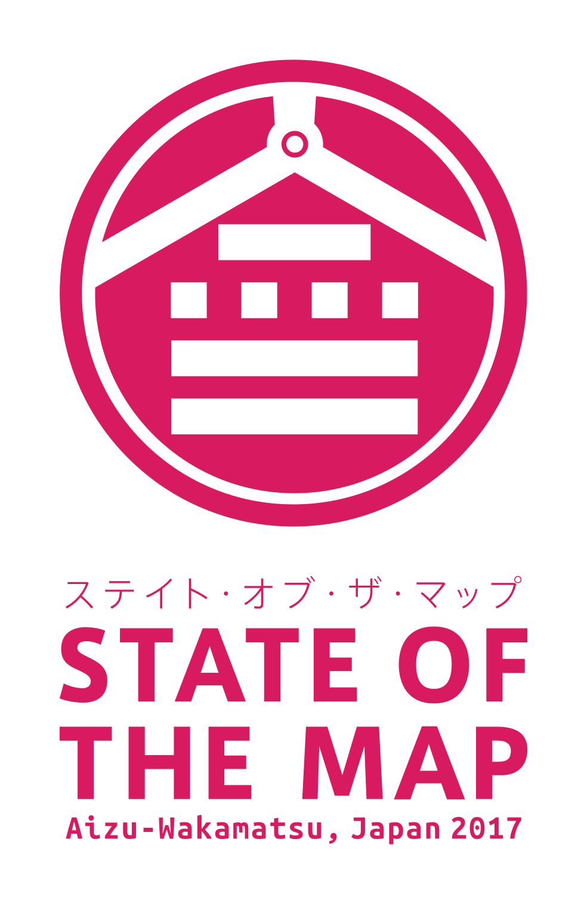

## Bio

清水俊之介 (Shunnosuke Shimizu)　/ 株式会社dott CTO

GDG Fuksuhima, GDG Cloud Fuksuhima オーガナイザー。Googleに魂を売った絵画修復士。

2008年イタリア・フィレンツェの[絵画修復学校](https://www.palazzospinelli.org/ita/default.asp)をアジア人として初めて首席として卒業。イタリア・トスカーナ州公認絵画修復技術士（絵画）。専門は絵画修復における化学。

帰国後フリーランスの修復士として活動を続ける傍ら、10歳の頃に出会ったWEBやプログラミングの分野でもフリーランスとして活動。

2011年の東日本大震災において放射線量を可視化するサイト「[RADIATIONDOSE](http://blog.livedoor.jp/pfj_blog/archives/50613678.html)」を立ち上げ、同じように技術による復興支援を行っていた[Hack for Japan](https://hack4.jp/)との出会いからスタッフとして参加。しばらくはエンジニアの道に専念することに。

2016年、Hack for Japanの活動を通して出会った盟友浅井渉と[株式会社dott](https://thedott.io)を設立。「デザインからDBまで」が担当分野。AngularやGoogle Cloud製品を使い、現在はTensorFlowとGCPのAI Platformを使った開発を行っている。

## Photos:

- [My photo](./img/shimizu.jpg)

## Links:

- Twitter: [@donuzium](https://twitter.com/donuzium)
- Medium: [@donuzium](https://medium.com/@donuzium)
- GitHub: [donuzium](https://github.com/donuzium)
- Facebook: [snsk.smz](https://www.facebook.com/snsk.smz)

## Codelabs:

- [NG ON FIRE!! ep.1](https://github.com/gdg-fukushima/ng-on-fire1)

## Awards
- Spajam 2017 本戦 - 審査員特別賞
- Spajam 2017 予選 - 最優秀賞
- 会津若松市オープンデータコンテスト 2017 優秀賞
- 会津若松市オープンデータコンテスト 2016 最優秀賞
- Spajam 2015 予選 - 最優秀賞

## Events

### 2019
- NG ON FIRE!! ep.1 in 福島市
- NG ON FIRE!! ep.1 in 会津若松市
- I/O Extended Sendai - [2019 Keynoteまとめ](https://docs.google.com/presentation/d/1foDCg5ICyhHZJlKfQr_Fh-NSl613wbK1zkwRS3I8ozk/edit#slide=id.p)
- I/O Extended Fukushima - [2019 Keynoteまとめ](https://docs.google.com/presentation/d/1foDCg5ICyhHZJlKfQr_Fh-NSl613wbK1zkwRS3I8ozk/edit#slide=id.p)
- GCPUG Fukushima - [下町ディープラーニング](https://docs.google.com/presentation/d/1TnwX8zvoC1JejKELHUWJyo7D20A4L-jR9cnjjJtKuhY/edit#slide=id.g4d91e49ebf_0_530)

### 2018
- HTML 5 APP CONFERENCE 2018 - [開発・運用・チームビルディング
HTML5 アプリのメリット](https://html5app-conf.connpass.com/event/87730/)
- Google I/O 報告会 - ML Kit for Firebase
- I/O Extended Fukushima - [2018 Keynoteまとめ](https://docs.google.com/presentation/d/15d6BenS4WbjB4-_HrKjHYCc_KwUjiucFcGMEexmaGB4/edit)
- GCPUG in Fukushima

### 2017
- Ionic Meetup Tokyo - 100万PVの[ゲーマガ](https://www.gamemaga.jp/)による知見tips

## Recent Works - Design, Video & Music

### Design
- State of the Map 2017 in Aizu-Wakamatsu

- dott Inc.

### Video & Music
- [Get Wild Tokyo 87-17 Remix (Video & Music w/ Suidobashi Desura)](https://www.youtube.com/watch?v=2uiZYSGQH6k)
- [State of the Map 2017 Promo (Video & Music)](https://www.youtube.com/watch?v=XB76k4yhmvo)
- [RE:BOOT BAKAVIRUS in Spajam 2017 (Video & Music w/ Ryokei Nakazono)](https://www.youtube.com/watch?v=hsM4uNAOvwE)
