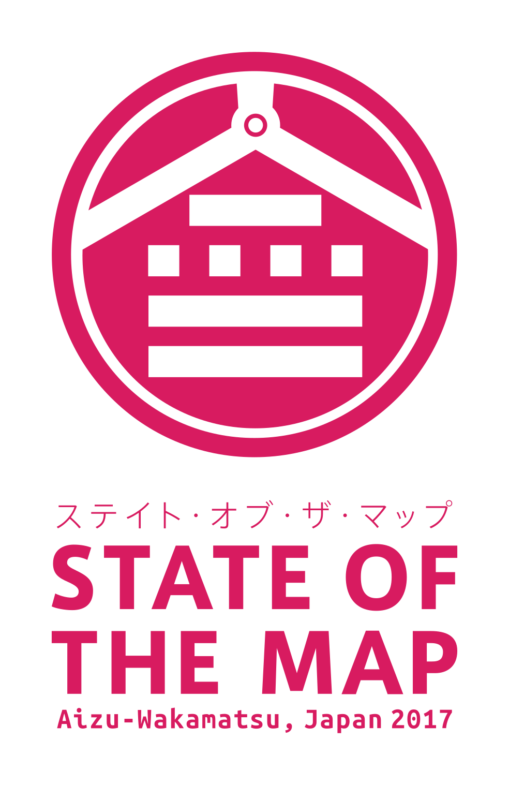

## Bio

清水俊之介 (Shunnosuke Shimizu)　/ 株式会社dott CTO

2008年イタリア・フィレンツェの[絵画修復学校](https://www.palazzospinelli.org/ita/default.asp)をアジア人として初めて首席として卒業。イタリア・トスカーナ州公認絵画修復技術士（絵画）。専門は絵画修復における化学。

帰国後フリーランスの修復士として活動を続ける傍ら、10歳の頃に出会ったWEBやプログラミングの分野でもフリーランスとして活動。

2011年の東日本大震災において放射線量を可視化するサイト「[RADIATIONDOSE](http://blog.livedoor.jp/pfj_blog/archives/50613678.html)」を立ち上げ、同じように技術による復興支援を行っていた[Hack for Japan](https://hack4.jp/)との出会いからスタッフとして参加。しばらくはエンジニアの道に専念することに。

2016年、Hack for Japanの活動を通して出会った盟友浅井渉と[株式会社dott](https://thedott.io)を設立。現在はAIモデルの研究開発・システム開発に従事。

2023年、OpenStreetMapの国際人道支援チーム「HOTOSM」にVoting Memberとして選出。以降、地図による人道支援に携わる。

2024年、ヒトの脳とAIについての理解を深めるため、日本では珍しく臨床（診察や検査）に使用されていない実験専門のMRIを持つ新潟医療福祉大学大学院に入学。2026年3月卒業。修士論文のタイトルは「微細な刺激の差異に対する脳機能解析の時空間深層学習アプローチ」。2026年からは同大学の博士後期課程へと進む。

## Photos:

- [My photo](./img/shimizu.jpg)

## Links:

- X: [@donuzium](https://x.com/donuzium)
- Medium: [@donuzium](https://medium.com/@donuzium)
- GitHub: [donuzium](https://github.com/donuzium)
- Facebook: [snsk.smz](https://www.facebook.com/snsk.smz)

## Recent Works - Design, Video & Music

### Design

#### MUUQU / 2023 - Current

#### dott Inc. / 2021 - Current

#### State of the Map 2017 in Aizu-Wakamatsu

#### dott Inc. / 2016 - 2021

### Video & Music
- [Get Wild Tokyo 87-17 Remix (Video & Music w/ Suidobashi Desura)](https://www.youtube.com/watch?v=2uiZYSGQH6k)
- [State of the Map 2017 Promo (Video & Music)](https://www.youtube.com/watch?v=XB76k4yhmvo)
- [RE:BOOT BAKAVIRUS in Spajam 2017 (Video & Music w/ Ryokei Nakazono)](https://www.youtube.com/watch?v=hsM4uNAOvwE)

## Awards
- Spajam 2017 本戦 - 審査員特別賞
- Spajam 2017 予選 - 最優秀賞
- 会津若松市オープンデータコンテスト 2017 優秀賞
- 会津若松市オープンデータコンテスト 2016 最優秀賞
- Spajam 2015 予選 - 最優秀賞
